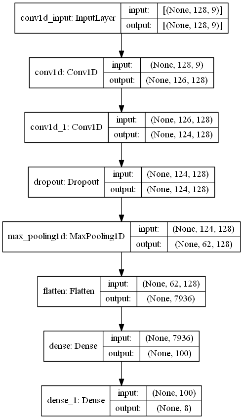

Content of this repo
==================
This is a repository containing the code I used to generate an entry for Emteq 2019 ActivityRecognition contest. The repo contains following files:

1. cnn_networks.ipynb - actual file that I used for the contest; contains convolutional neural network approach;
2. rnn_networks.ipnyb - contains the other approach I have tested - with recurrent neural networks;
3. simple_networks - file constains very simple network architecture, with fully connected layers;
4. /models - directory with serialized models that can be used as examples, including the one I used for contest.

The dataset for the emteq 2019 activity recognition challenge is available here (www.emteq.net).
To implement my models I gained knowledge from and used some code samples from https://machinelearningmastery.com/ (especially all materials under https://machinelearningmastery.com/deep-learning-models-for-human-activity-recognition/).

System description
==================

Brief overview
--------------

Whole system has been implemented in Python and scipy stack together with keras library. Data from all three sets 1-3 has been used for training. The proposed classifier consists of 10 trained neural networks built with keras and final solution has been obtained taking into account all of the networks answers. Details of each main step has been described in the following sections.

Data preparation
----------------

Data from the contest have been read using pandas library and simple preprocessing has been conducted including converting activity descriptions to float numbers. Next, the ’TRANSITION’ activity has been filtered out and the rest of samples has been divided into sliding windows. Since all of the features more or less follow the gaussian distribution, data samples has been normalized using maximum, minimum and mean value calculated on all of the datasets (including testset).

Chosen windows length is 128 samples and the offset is 64 - half of the windows size. This way, each data sample was present in two windows. From this moment, each window containing 128 time-stamped samples has been treated as standalone sample. The window has been represented as the matrix of size 128x9 where 9 stand for 9-element feature vector of each time-stamped sample. For each newly created sample one activity label has been provided. The decision which label to choose was done taking the majority of labels present for 128 samples used for the window. Since each activity consisted of more than 128 samples, no data was lost this way. For each of the labels, one hot encoding has been used to prepare training set. As the training set the concatenation of results of all mentioned procedures for the three training sets has been used. All of this can be summarized as:

1.  Training X: shape 32796 x 128 x 9, where:

    -   32796 is number of all samples coming from datasets 1,2 and 3;

    -   128 is the number of time-stamped samples contained within one sliding window with 64 offset;

    -   9 is the number of features for one time-stamped sample.

2.  Training y: shape 32796 x 8, where:

    -   32796 is number of all samples coming from datasets 1,2 and 3;

    -   8 is the one hot encoded vector for 8 different acitivity labels.

Training classifier
-------------------

The neural network classifier has been constructed using keras library. The constructed model consisted of the following layers:

1.  Convolutional 1D layer with 128 filters and kernerl size 3 and ReLu activation;

2.  Convolutional 1D layer with 128 filters and kernerl size 3 and ReLu activation;

3.  Dropout layer with rate 0.5;

4.  Pooling 1D layer with the pool size of 2;

5.  Flattening layer;

6.  Densely Connected layer with 100 units and ReLu activation;

7.  Densely Connected layer with 8 units and Softmax activation;

and it as been trained in 10 epochs with batches of size 32. The graph describing neural network classifier is presented on figure 1. Because of their stochastic nature, total number of 10 independent classifiers has been used to determine the final output.

Obtaining final results
-----------------------

First of all, the predictions for fourth dataset has been conducted for all ten classifiers. Then, based on the fact that each different activity is separated by the “TRANSITION” activity, the predictions has been grouped into time slots that surely contain only one activity. On every such timeslot two votings has been made:

1.  which prediction is the major one between time windows;

2.  which prediction from above ones is the major one between each trained models.

The leading activity class has been chosen as the answer for the whole time slots between two consecutive ’TRANSITION’ activities. Following this, the time-stamped samples has been recreated from the windows with the leading label assigned.
